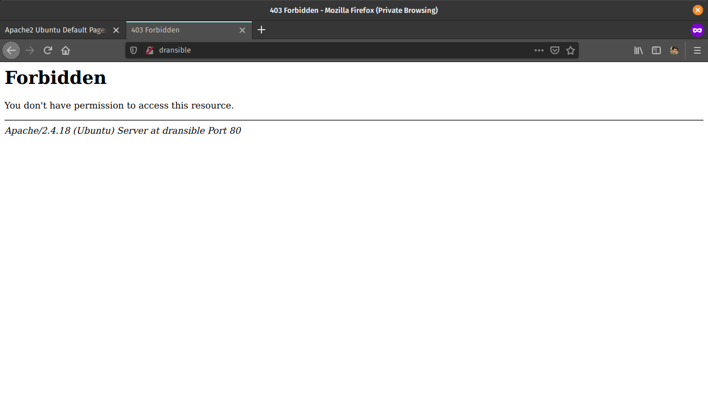
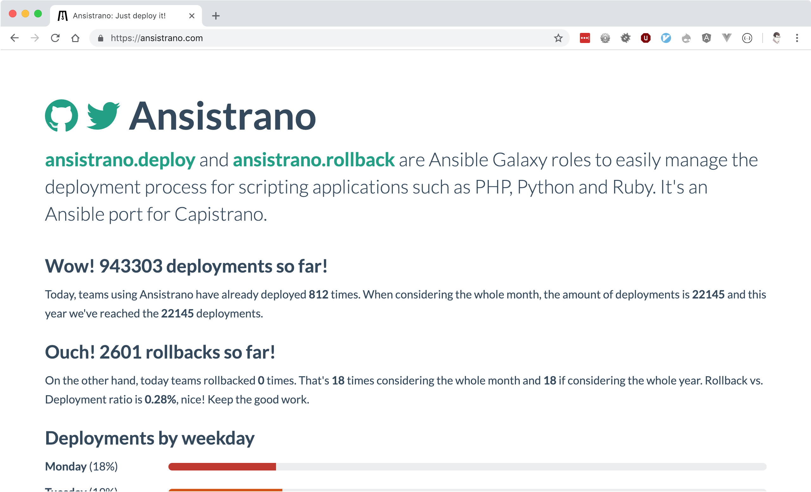

# Deploying PHP applications with _Ansible, Ansible Vault and Ansistrano_
<!-- .element class="max-w-4xl mx-auto text-6xl font-bold text-center" -->

Note: I work primarily with PHP, and there will be some PHP-isms in this talk (LAMP stack, Composer).
Will be using a Drupal 8 application as the example, but the tools are tool and language agnostic.

~~~~~

## Things we'll be looking at
- _**Ansible**_ crash course
- Keeping secrets with _**Ansible Vault**_
- Deployments with _**Ansistrano**_

~~~~~

<div class="grid grid-cols-5 gap-10">
<div class="grid col-span-4">

- Full Stack Software Developer & System Administrator
- Senior Software Engineer at Inviqa
- Part-time freelancer
- PHP South Wales organiser
- https://www.oliverdavies.uk
- [@opdavies](https://twitter.com/opdavies)

</div>
<div class="col-span-1">

<!-- .element: class="rounded-full_" -->
<!-- .element: class="mt-10" -->

</div>  
</div>

Note: - I maintain Drupal modules, PHP CLI tools and libraries, Ansible roles
- Blog on my website
- I work primarily with Drupal and Symfony I work for Inviqa, but this
based on my personal and side projects.
- I've been using Ansible for a number of years, initially only for provisioning and setting up my laptop, and later for application deployments
~~~~~

<div class="flex flex-wrap justify-center space-y-16">
  <div>
    
    </div>
    <div>
      
    </div>
    <div>
      
    </div>
</div>

Note: - Large, well-known managed hosting companies Optimised servers for PHP/Drupal applications
- Include some sort of deployment system This workflow doesn't apply to this scenario

~~~

<div class="grid grid-cols-3 gap-12">
  <div class="flex items-center">
    <div>
      
    </div>
  </div>
  <div class="flex items-center">
    <div>
      
    </div>
  </div>
  <div class="flex items-center">
    <div>
      
    </div>
  </div>
</div>

Note: - More applicable to virtual or dedicated servers with no existing deployment
process
- Not enough budget for fully-managed, or using internal infrastructure
- This is where the this workflow would be useful

~~~~~

<!-- .slide: class="section-title" -->

## What is Ansible?

~~~

<div class="grid grid-cols-4 gap-20">
<div class="col-span-3">

## Ansible is an open-source _software provisioning_, _configuration management_, and _application-deployment_ tool.
<!-- .element class="text-5xl" -->

https://en.wikipedia.org/wiki/Ansible_(software)
<!-- .element class="mt-16 text-lg" -->

</div>

<div class="grid-cols-1">
<div class="h-full flex items-center">


</div>
</div>
</div>

~~~

<div class="grid grid-cols-4 gap-20">
<div class="col-span-3">

## What is Ansible?

- CLI tool
- Configured with YAML
- Agentless, connects via SSH
- Jinja2 for templating
- Executes ad-hoc remote commands
- Installs software packages
- Performs deployment steps
- Batteries included

</div>

<div class="grid-cols-1">
<div class="h-full flex items-center">


</div>
</div>
</div>

Note:
- Written in Python but configured with Yaml.
- Drupal, Symfony and a lot of other projects use YAML.
- Nothing needed on the server, other than Python.
- First-party modules (SSH keys, file and directory management, package repositories, stopping/starting/restarting services, DO/Linode/AWS integration).

~~~

<div class="grid grid-cols-4 gap-20">
<div class="col-span-3">

## Why Ansible?

- Familiar syntax (Drupal 8, Symfony, Sculpin)
- Easily readable
- No server dependencies
- Easy to add to an existing project
- Includes relevant modules (Git, Composer)
- Idempotency, resulting in cleaner scripts

</div>

<div class="grid-cols-1">
<div class="h-full flex items-center">


</div>
</div>
</div>

~~~~~

## Hosts / Inventories
<!-- .element: class="text-6xl text-center" -->

~~~

## hosts.ini
<pre class="lang-ini"><code class="lang-ini" data-line-numbers data-trim>
[webservers]
192.168.33.10

[webservers:vars]
ansible_ssh_port=22
ansible_ssh_user=opdavies
</code></pre>

Note: Vagrant IP address.
Supports wildcards and ranges

~~~

## hosts.yml
<pre class="text-3xl">
<code data-trim data-line-numbers>
---
all:
  children:
    webservers:
      hosts:
        192.168.33.10:
      vars:
        ansible_ssh_port: 22
        ansible_ssh_user: opdavies
</code></pre>

Note: My prefered format.
More consistency across the project, easier to copy variables from other places such as playbooks.

~~~~~

## Ad-hoc Commands
<!-- .element: class="text-6xl text-center" -->

~~~

<!-- .slide: class="text-center bg-black text-white" -->

<pre class="plain">
  <code class="text-5xl">ansible all -i hosts.yml -m ping</code>
</pre>

Note: Single ad-hoc command.
-i = inventory
-m = module

~~~

<!-- .slide: class="bg-black text-white" -->

```plain
webservers | SUCCESS => {
    "ansible_facts": {
        "discovered_interpreter_python": "/usr/bin/python"
    },
    "changed": false,
    "ping": "pong"
}
```
<!-- .element class="text-3xl" -->

~~~

<!-- .slide: class="text-center bg-black text-white" -->

<pre class="language-plain whitespace-pre-line">
  <code class="text-5xl" data-trim>
    ansible all -i hosts.yml
    -m command
    -a "git pull
    --chdir=/app"
  </code>
</pre>

Note: Update a codebase using "git pull"
-a = (additional) arguments
--chdir = change directory

~~~

<!-- .slide: class="text-center bg-black text-white" -->

<pre class="language-plain whitespace-pre-line wrap-word">
  <code class="text-5xl" data-trim>
    ansible all -i hosts.yml
    -m git
    -a "repo=https://github.com
    /opdavies/dransible
    --chdir=/app"
  </code>
</pre>

Note: Same example, but using the core "Git" module

~~~~~

## Playbooks
<!-- .element: class="text-center text-6xl" -->

~~~

<pre><code data-trim data-line-numbers>
---
- hosts: webservers

  vars:
    git_repo: https://github.com/opdavies/dransible
    project_root_dir: /app

  tasks:
    - name: Update the code
      git:
        repo: '{{ git_repo }}'
        dest: '{{ project_root_dir }}'
</code></pre>
<!-- .element: class="text-3xl" -->

Note: YAML file
Collection of multiple tasks
Can add and use variables

~~~

<!-- .slide: class="text-center bg-black text-white" -->
 
<pre class="plain">
  <code class="text-5xl" data-trim>
    ansible-playbook main.yml
    -i hosts.yml
  </code>
</pre>

Note: How do we run a playbook?
Use the "ansible-playbook" command and specify the name of the playbook.

~~~~~

## Roles: configuring a <br>LAMP stack
<!-- .element: class="text-center text-6xl" -->

~~~

## requirements.yml
<pre><code data-trim data-line-numbers>
---
- src: geerlingguy.apache
- src: geerlingguy.composer
- src: geerlingguy.mysql
- src: geerlingguy.php
- src: geerlingguy.php-mysql
</code></pre>

Note: Requirements file for Ansible roles
Typically requirements.yml
Pulled from Ansible Galaxy
Equivilent to composer.json/Packagist in PHP

~~~

<!-- .slide: class="text-center bg-black text-white" -->

<pre class="language-plain whitespace-pre-line wrap-word">
  <code class="text-5xl" data-trim>
ansible-galaxy install
-r requirements.yml
  </code>
</pre>

~~~

<pre><code data-trim data-line-numbers>
---
- hosts: webservers

  roles:
    - geerlingguy.apache
    - geerlingguy.mysql
    - geerlingguy.php
    - geerlingguy.php-mysql
    - geerlingguy.composer
</code></pre>

Note: How do we use them?
Add them to the playbook under "roles".
Ordering matters here!
If these were ordered alphabetically then Composer install would fail because it would run before PHP is installed.

~~~

<pre><code data-trim data-line-numbers>
---
vars:
  apache_vhosts:
    - servername: dransible
      documentroot: /app/web
</code></pre>

Note: configuring the Apache role to install virtual hosts.

~~~

<pre><code data-trim data-line-numbers>
---
vars:
  php_version: 7.4
  php_packages_extra:
    - libapache2-mod-php{{ php_version }}
    - libpcre3-dev
</code></pre>

Note: configuring PHP.

~~~

<pre><code data-trim data-line-numbers class="yaml">
---
vars:
  mysql_databases:
    - name: main

  mysql_users:
    - name: user
      password: secret
      priv: main.*:ALL
</code></pre>

Note: configuring MySQL databases and users.

~~~

<!-- .slide: class="text-center bg-black text-white" -->

<pre class="language-plain whitespace-pre-line wrap-word">
  <code class="text-5xl" data-trim>
ansible-playbook provision.yml
-i hosts.yml
  </code>
</pre>

~~~

<!-- .slide: class="bg-black text-white" -->

<pre class="text-base leading-relaxed"><code class="language-plain">
PLAY [Provision the webserver machines] ********************************************************************************

TASK [Gathering Facts] *************************************************************************************************
ok: [webservers]

TASK [geerlingguy.apache : Include OS-specific variables.] *************************************************************
ok: [webservers]

TASK [geerlingguy.apache : Include variables for Amazon Linux.]
skipping: [webservers]

TASK [geerlingguy.apache : Define apache_packages.] ********************************************************************
ok: [webservers]

TASK [geerlingguy.apache : include_tasks] ******************************************************************************
included: /Users/opdavies/.ansible/roles/geerlingguy.apache/tasks/setup-Debian.yml for webservers

TASK [geerlingguy.apache : Update apt cache.] **************************************************************************
changed: [webservers]
</code></pre>
~~~

<!-- .slide: class="bg-black text-white" -->

<pre class="text-base leading-snug"><code class="language-plain">
TASK [geerlingguy.composer : Ensure composer directory exists.] ********************************************************
ok: [webservers]

TASK [geerlingguy.composer : include_tasks] ****************************************************************************
skipping: [webservers]

TASK [geerlingguy.composer : include_tasks] ****************************************************************************
skipping: [webservers]

RUNNING HANDLER [geerlingguy.apache : restart apache] ******************************************************************
changed: [webservers]

RUNNING HANDLER [geerlingguy.mysql : restart mysql] ********************************************************************
changed: [webservers]

RUNNING HANDLER [geerlingguy.php : restart webserver] ******************************************************************
changed: [webservers]

RUNNING HANDLER [geerlingguy.php : restart php-fpm] ********************************************************************
skipping: [webservers]

PLAY RECAP *************************************************************************************************************
webservers                 : ok=111  changed=32   unreachable=0    failed=0    skipped=78   rescued=0    ignored=0
</code></pre>

~~~

<!-- .element: class="border-2" -->

Note: IP address of server, Apache is installed and running.

~~~

<!-- .element: class="border-2" -->

Note: No application code on the server yet.

~~~~~

## Basic deployment
<!-- .element: class="text-6xl text-center" -->

~~~

## deploy.yml
<pre class="text-xl"><code data-trim data-line-numbers>
---
tasks:
  - name: Creating project directory
    file:
      path: /app
      state: directory

  - name: Uploading application
    synchronize:
      src: '{{ playbook_dir }}/../'
      dest: /app

  - name: Installing Composer dependencies
    composer:
      command: install
      working_dir: /app
</code></pre>

Note: Using file module to create the directory
Using synchronize module/rsync to upload the files
Using Composer module to install dependencies. There are other possible values.

~~~

<!-- .slide: class="text-center bg-black text-white" -->

<pre class="language-plain whitespace-pre-line wrap-word">
  <code class="text-5xl" data-trim>
ansible-playbook deploy.yml
-i hosts.yml
  </code>
</pre>

~~~

<!-- .element: class="border-2" -->

~~~

## Disadvantages
- Sensitive data stored in plain text
- Single point of failure
- No ability to roll back

~~~~~

## Keeping secrets with <br>_Ansible Vault_
<!-- .element: class="text-6xl text-center" -->

~~~

<pre><code class="language-yaml" data-trim data-line-numbers>
---
vars:
  mysql_databases:
      - name: main

    mysql_users:
      - name: user
        password: secret
        priv: main.*:ALL
</code></pre>

~~~

<pre><code class="language-yaml" data-trim data-line-numbers>
---
vault_database_name: main
vault_database_user: user
vault_database_password: secret
</code></pre>

~~~

<!-- .slide: class="text-center bg-black text-white" -->
<pre class="language-plain whitespace-pre-line wrap-word">
  <code class="text-5xl" data-trim>
ansible-vault encrypt
provision_vault.yml

New Vault password: 
Confirm New Vault password: 
Encryption successful
  </code>
</pre>

~~~

<!-- .slide: class="bg-black text-white" -->
<pre class="language-plain whitespace-pre-line wrap-word">
  <code class="text-2xl" data-trim>
$ANSIBLE_VAULT;1.1;AES256
63656632326165643137646334343537396533656565313032363262623962393861666438393539
6366336638316133373061306332303761383565343035330a373637373830356430353630356161
32313831663039343733343539636365386333303862363635323138346137666166356639323338
3264636538356634390a343766353661386666376362376439386630363664616166643364366335
62373530393933373830306338386539626565313364643133666131613138383431353638636334
39376437633462373934313236363662633832643138386433646230313465383337373031373137
61353963623364393134386335373731356337366464633531656435383161656435313530363234
37373865393839616534353165656463313961333532363537383263343364646534333032336337
3235

  </code>
</pre>

~~~

<pre class="text-3xl">
<code class="language-yaml" data-trim data-line-numbers>
---
database_name: '{{ vault_database_name }}'
database_user: '{{ vault_database_user }}'
database_password: '{{ vault_database_password }}'
</code></pre>

~~~

## provision.yml
<pre class="text-2xl">
<code class="language-yaml" data-trim data-line-numbers>
---
  vars_files:
    - vars/provision_vault.yml
    - vars/provision_vars.yml

  vars:
    mysql_databases:
      - '{{ database_name }}'

    mysql_users:
      - name: '{{ database_user }}'
        password: '{{ database_password }}'
        priv: '{{ database_name }}.*:ALL'
</code></pre>

~~~

<!-- .slide: class="text-center bg-black text-white" -->
<pre class="language-plain whitespace-pre-line wrap-word">
  <code class="text-5xl" data-trim>
ansible-playbook deploy.yml
-i hosts.yml
--ask-vault-pass
  </code>
</pre>

~~~

<!-- .slide: class="text-center bg-black text-white" -->
<pre class="language-plain whitespace-pre-line wrap-word">
  <code class="text-5xl" data-trim>
ansible-playbook deploy.yml
-i hosts.yml
--vault-password-file secret.txt
  </code>
</pre>

~~~~~

## Better deployments with _Ansistrano_
<!-- .element: class="text-6xl text-center" -->

~~~

<!-- .element: class="border-2" -->

~~~

## Features
- Multiple release directories
- Shared paths and files
- Customisable
- Multiple deployment strategies
- Multi-stage environments
- Prune old releases
- Rollbacks

~~~

## requirements.yml
<pre><code data-trim data-line-numbers>
---

- src: ansistrano.deploy
- src: ansistrano.rollback
</code></pre>

Note: to install Ansistrano, add the additional roles to the requirements.yml file

~~~

## deploy.yml
<pre><code data-trim data-line-numbers>
---
- hosts: all

  roles:
    - ansistrano.deploy
</code></pre>

Note: add to roles within the playbook

~~~

## deploy.yml
<pre class="text-2xl"><code data-trim data-line-numbers>
---
  vars:
    project_deploy_dir: /app

    ansistrano_deploy_to: '{{ project_deploy_dir }}'
    ansistrano_deploy_via: git
    ansistrano_git_branch: master
    ansistrano_git_repo: 'git@github.com:opdavies/dransible'
</code></pre>

~~~

<!-- .slide: class="bg-black text-white" -->
<pre class="text-base"><code class="language-plain">
PLAY [webservers] ******************************************************************************************************

TASK [Gathering Facts] *************************************************************************************************
ok: [webservers]

TASK [ansistrano.deploy : include_tasks] *******************************************************************************

TASK [ansistrano.deploy : include_tasks] *******************************************************************************
included: /Users/opdavies/.ansible/roles/ansistrano.deploy/tasks/setup.yml for webservers

TASK [ansistrano.deploy : ANSISTRANO | Ensure deployment base path exists] *********************************************
ok: [webservers]

TASK [ansistrano.deploy : ANSISTRANO | Ensure releases folder exists] **************************************************
ok: [webservers]

TASK [ansistrano.deploy : ANSISTRANO | Ensure shared elements folder exists] *******************************************
ok: [webservers]

TASK [ansistrano.deploy : ANSISTRANO | Ensure shared paths exists] *****************************************************
ok: [webservers] => (item=web/sites/default/files)
</code></pre>

~~~

<!-- .slide: class="bg-black text-white" -->
<pre class="text-base"><code class="language-plain">
TASK [ansistrano.deploy : Update file permissions] *********************************************************************
changed: [webservers]

TASK [ansistrano.deploy : include_tasks] *******************************************************************************

TASK [ansistrano.deploy : include_tasks] *******************************************************************************
included: /Users/opdavies/.ansible/roles/ansistrano.deploy/tasks/cleanup.yml for webservers

TASK [ansistrano.deploy : ANSISTRANO | Clean up releases] **************************************************************
changed: [webservers]

TASK [ansistrano.deploy : include_tasks] *******************************************************************************

TASK [ansistrano.deploy : include_tasks] *******************************************************************************
included: /Users/opdavies/.ansible/roles/ansistrano.deploy/tasks/anon-stats.yml for webservers

TASK [ansistrano.deploy : ANSISTRANO | Send anonymous stats] ***********************************************************
skipping: [webservers]

PLAY RECAP *************************************************************************************************************
webservers                 : ok=33   changed=14   unreachable=0    failed=0    skipped=7    rescued=0    ignored=0
</code></pre>

~~~

<!-- .slide: class="bg-black text-white" -->
<pre class="text-2xl"><code class="language-plain">
vagrant@dransible:/app$ ls -l
total 8

lrwxrwxrwx 1   26 Jul 19 00:15 current -> ./releases/20190719001241Z
drwxr-xr-x 5 4096 Jul 22 20:30 releases
drwxr-xr-x 4 4096 Jul 19 00:00 shared
</code></pre>

~~~

<!-- .slide: class="bg-black text-white" -->
<pre class="text-2xl"><code class="language-plain">
vagrant@dransible:/app/releases$ ls -l
total 20

drwxr-xr-x  5 4096 Jul 22 20:30 .
drwxr-xr-x  4 4096 Jul 19 00:15 ..
drwxr-xr-x 10 4096 Jul 19 00:02 20190719000013Z
drwxr-xr-x 10 4096 Jul 19 00:14 20190719001241Z
drwxr-xr-x  9 4096 Jul 22 20:30 20190722203038Z
</code></pre>

~~~

## rollback.yml
<pre class="text-3xl">
<code class="lang-yaml" data-trim data-line-numbers>
---
- hosts: all

  roles:
    - ansistrano.rollback

  vars:
    ansistrano_deploy_to: '{{ project_deploy_dir }}'
</code></pre>

~~~

<!-- .slide: class="bg-black text-center text-white" -->
<pre class="text-5xl"><code class="language-plain">
ansible-playbook rollback.yml
-i hosts.yml
</code></pre>

~~~~~

## Customising Ansistrano: <br>**Build Hooks**
<!-- .element: class="text-6xl text-center" -->

~~~

<!-- .element: class="mx-auto" -->

Note: Each step has a 'before' and 'after' step Ansistrano allows us to add more things by providing a path to a playbook and adding additional steps.

~~~

## deploy.yml
<pre class="text-xl">
<code class="lang-yaml" data-trim data-line-numbers>
---
  vars:
    ansistrano_after_symlink_shared_tasks_file: >
      '{{ playbook_dir }}/deploy/after-symlink-shared.yml'
    ansistrano_after_symlink_tasks_file: >
      '{{ playbook_dir }}/deploy/after-symlink.yml'
    ansistrano_after_update_code_tasks_file: >
      '{{ playbook_dir }}/deploy/after-update-code.yml'

    release_web_path: '{{ ansistrano_release_path.stdout }}/web'
    release_drush_path: '{{ ansistrano_release_path.stdout }}/vendor/bin/drush'
</code></pre>

~~~

## deploy/after-update-code.yml

<pre class="mt-10 text-2xl">
<code class="lang-yaml" data-trim data-line-numbers>
---
- name: Install Composer dependencies
  composer:
    command: install
    working_dir: '{{ ansistrano_release_path.stdout }}'
</code></pre>

~~~

## deploy/after-symlink-shared.yml

<pre class="mt-10 text-3xl">
<code class="lang-yaml" data-trim data-line-numbers>
---
- name: Run database updates
  command: >
    {{ release_drush_path }}
    --root {{ release_web_path }}
    updatedb
</code></pre>

~~~

## deploy/after-symlink.yml

<pre class="mt-10 text-3xl">
<code class="lang-yaml" data-trim data-line-numbers>
---
- name: Rebuild Drupal cache
  command: >
    {{ release_drush_path }}
    --root {{ release_web_path }}
    cache-rebuild
</code></pre>

~~~~~

## Demo
<!-- .element: class="text-6xl text-center" -->

~~~~~

## Useful links

- https://github.com/opdavies/dransible
- https://github.com/opdavies/oliverdavies-uk
- https://github.com/opdavies/ansible-role-drupal-settings
- https://docs.ansible.com
- https://docs.ansible.com/ansible/user_guide/vault.html
- https://www.ansistrano.com
- https://symfonycasts.com/screencast/ansistrano

~~~~~

## Questions?

- https://www.oliverdavies.uk
- https://twitter.com/opdavies
